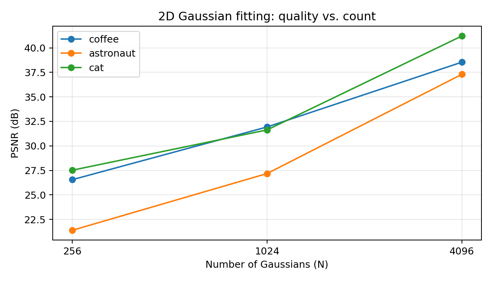

# P5 results

2000 Adam steps, lr=0.01, seed=0, longest image side <= 128px. Densification disabled.

| Image | N | PSNR (dB) | Float32 model (KiB) |
|---|---:|---:|---:|
| coffee | 256 | 26.54 | 9.0 |
| coffee | 1024 | 31.93 | 36.0 |
| coffee | 4096 | 38.54 | 144.0 |
| astronaut | 256 | 21.38 | 9.0 |
| astronaut | 1024 | 27.17 | 36.0 |
| astronaut | 4096 | 37.30 | 144.0 |
| cat | 256 | 27.51 | 9.0 |
| cat | 1024 | 31.63 | 36.0 |
| cat | 4096 | 41.21 | 144.0 |

Compare the saved renders to judge when each image looks right. Expected: the cup's smooth regions can use broad Gaussians, the portrait also needs smaller Gaussians for edges and facial detail, and dense fur needs many small Gaussians. Check this expectation against your measured curves and renders. Model sizes count nine float32 values per Gaussian and exclude checkpoint metadata.
