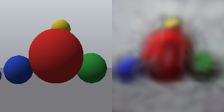
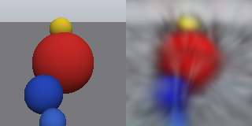
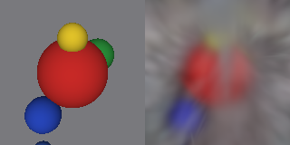

# P7 results

Mean training-view PSNR: **21.09 dB** over 44 views (arithmetic mean of the per-view PSNRs, measured on float renders).

Used **1024 Gaussians**, 1000 Adam steps, lr=0.01, seed=0. Centers were uniform in [-1.5, 1.5]^3, scales were 0.08 on each axis, quaternions were (1, 0, 0, 0), colors started at sigmoid(0)=0.5, and opacities at sigmoid(-2)≈0.119. Each step sampled one training camera. Images retained their original resolution and shared K. Projected covariances use a 1e-4 pixel-variance diagonal regularizer.

Ground truth is on the left; render is on the right.

train/000.png — 21.13 dB

train/022.png — 21.82 dB

train/043.png — 19.49 dB

