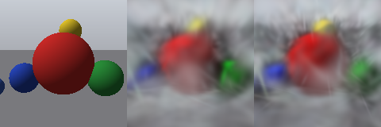
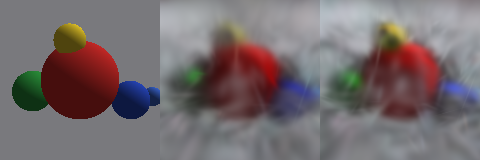
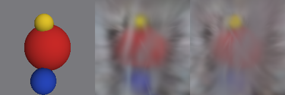

# P8 results

Both fits used 1500 Adam steps, lr=0.01, seed=1, and the same sampled training-camera sequence. The common budget was 1024; the table reports actual final counts. PSNR is the arithmetic mean over each split, computed from float renders. Held-out images did not enter the loss.

Initialization followed P7: centers uniform in [-1.5,1.5]^3, scales 0.08, identity quaternions, gray colors, and opacity sigmoid(-2).

Every 200 steps before the final step, mean position-gradient norms were compared with 0.0002. Size is now measured in world units: max scale <= 0.05 is cloned in place; larger selected Gaussians are replaced by two children with scales divided by 1.6. Split offsets are sampled in 3D, scaled along the parent's axes, rotated by its quaternion, and applied with opposite signs. Quaternions, colors, and opacities are copied.

Pruning removes opacity < 0.005, including when the budget is full; one primitive is retained if all would be removed. The largest eligible gradient scores get remaining capacity. As in P4, surviving Adam moments are preserved, new rows get zero moments, and gradient averages reset after each pass. Adam's tensor step counter is retained.

Completed 7 passes, pruning 0 primitives in total.

| Fit | Initial N | Final N | Training PSNR | Held-out PSNR |
|---|---:|---:|---:|---:|
| plain | 1024 | 1024 | 22.17 dB | 17.20 dB |
| densified | 256 | 1024 | 22.99 dB | 16.86 dB |

Higher held-out PSNR: **plain**.

Panels show **ground truth | plain | densified** for the same held-out camera. Inspect the background and silhouettes for floater reduction.

val/000.png

val/006.png

val/011.png

