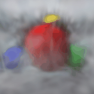

# P9 results

Checkpoint: outputs\p7_2048\scene.pt

Gaussians: 2048

Mean training PSNR: 22.89 dB

Mean held-out PSNR: 16.89 dB

Training minus held-out: 6.00 dB

Metrics are arithmetic means of per-view PSNRs from float renders, before PNG/GIF conversion. No optimization was performed. Comparison panels show ground truth left, render right.

The novel sequence follows a 40-degree arc about the world origin, using the first held-out camera's up axis and preserving its intrinsics. These generated views have no ground truth, so no PSNR is assigned to them.

Inspect silhouettes, background haze, gaps, and changes between frames. Describe only artifacts visible in your results; distinguish limited coverage, limited Gaussian capacity, and inconsistent geometry as possible explanations.
